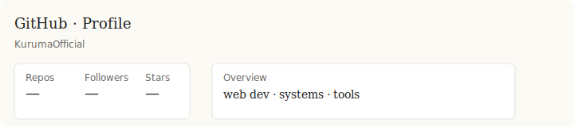
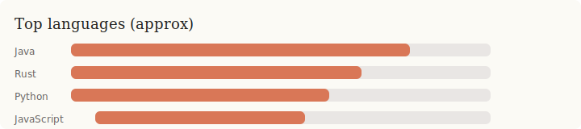

<!-- Variant: v5 — restored and adapted for dark background -->
<!-- canonical_langs_bars: https://github.com/KurumaOfficial/KurumaOfficial/blob/main/assets/langs_bars.svg -->

 

---

Designed for dark background — this README is optimized for dark site backgrounds.

 

---

<table>
<tr>
<td valign="top" width="50%">

**🇷🇺 О себе**

Бла бла бла. Бла бла бла бла бла бла бла бла.  
Бла бла бла бла бла. Бла бла бла бла бла бла бла бла бла.  
Бла бла бла бла бла бла бла бла.

</td>
<td valign="top" width="50%">

**🇬🇧 About me**

Bla bla bla. Bla bla bla bla bla bla bla bla.  
Bla bla bla bla bla. Bla bla bla bla bla bla bla bla bla.  
Bla bla bla bla bla bla bla bla.

</td>
</tr>
</table>

---

## 𝗟𝗮𝗻𝗴𝘂𝗮𝗴𝗲𝘀

## 𝗜𝗻𝗳𝗿𝗮𝘀𝘁𝗿𝘂𝗰𝘁𝘂𝗿𝗲 & 𝗧𝗼𝗼𝗹𝘀

---

## 𝗦𝘁𝗮𝘁𝘀

  
  
   
  

---

## 𝗖𝘂𝗿𝗿𝗲𝗻𝘁𝗹𝘆 𝘄𝗼𝗿𝗸𝗶𝗻𝗴 𝗼𝗻

---

© KurumaOfficial · WeTTeA

