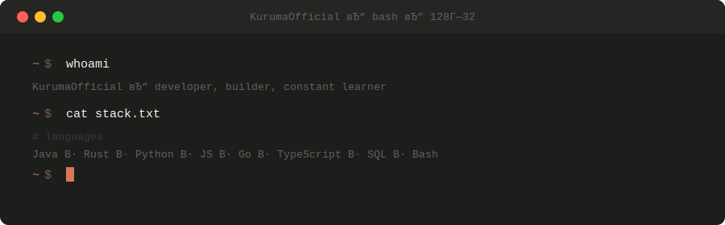

<!-- Variant: v5 — restored and adapted for dark background -->
<!-- canonical_langs_bars: https://github.com/KurumaOfficial/KurumaOfficial/blob/main/assets/langs_bars.svg -->

 

---

---

<table style="width:100%; border-collapse:separate; border-spacing:16px 0;">
<tr>
<td valign="top" style="width:49%; padding:18px; border:1px solid rgba(255,255,255,0.06); border-radius:6px; background:transparent;">

**🇷🇺 О себе**

Разработчик с фокусом на backend системы и инфраструктуру.  
Работаю с Java, Rust, Python, Go и современным стеком технологий.  
Создаю масштабируемые решения и open-source инструменты.

</td>
<td valign="top" style="width:49%; padding:18px; border:1px solid rgba(255,255,255,0.06); border-radius:6px; background:transparent;">

**🇬🇧 About me**

Developer focused on backend systems and infrastructure.  
Working with Java, Rust, Python, Go and modern tech stack.  
Building scalable solutions and open-source tools.

</td>
</tr>
</table>

---

## 𝗟𝗮𝗻𝗴𝘂𝗮𝗴𝗲𝘀

## 𝗜𝗻𝗳𝗿𝗮𝘀𝘁𝗿𝘂𝗰𝘁𝘂𝗿𝗲 & 𝗧𝗼𝗼𝗹𝘀

---

## 𝗦𝘁𝗮𝘁𝘀

  
   
  

---

## 𝗖𝘂𝗿𝗿𝗲𝗻𝘁𝗹𝘆 𝘄𝗼𝗿𝗸𝗶𝗻𝗴 𝗼𝗻

Currently: [wettea.dev](https://wettea.dev)

---

© Kuruma · WeTTeA

