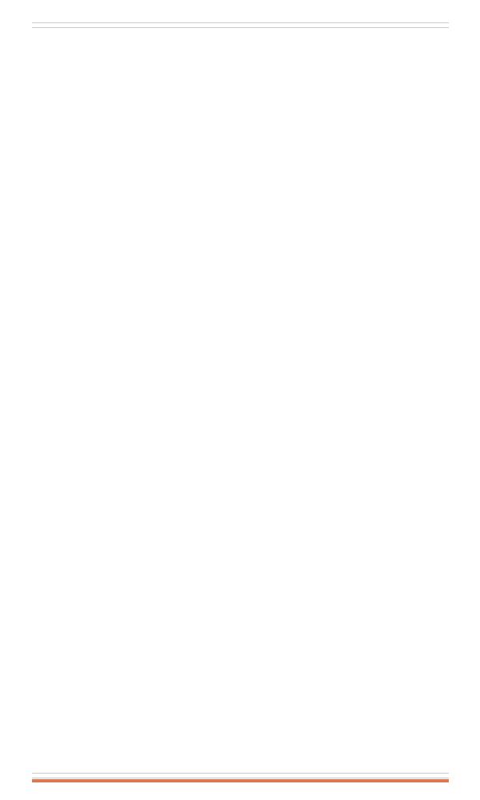



<table style="border-collapse:separate; border-spacing:0 0;"><tr>
  <td width="50%" valign="middle" align="center" style="background:#0d1117; padding:12px 14px 12px 0;">
    
About me

    

    
Developer focused on <strong style="color:#fbfaf5;">backend systems</strong> and <strong style="color:#fbfaf5;">infrastructure</strong>. Building scalable solutions and pragmatic open-source projects for real-world use.

    

    
Tech Stack

    

      <strong style="color:#fbfaf5;">Languages:</strong> Kotlin · Rust · Go · Python 
      <strong style="color:#fbfaf5;">Data:</strong> PostgreSQL · Redis 
      <strong style="color:#fbfaf5;">Infra:</strong> Docker · Kafka · gRPC
    

  </td>
  <td width="50%" valign="middle" align="center" style="padding:12px 0 12px 14px;">
    
  </td>
</tr></table>

  <em>Backend &amp; Infrastructure · Scalable systems &amp; open-source</em>

---

## About

> Developer focused on **backend systems** and **infrastructure**.
> Building scalable solutions and pragmatic open-source projects.

**Stack:** Kotlin · Rust · Go · Python · PostgreSQL · Docker · Redis · Kafka · gRPC

---

  
  
  

  

