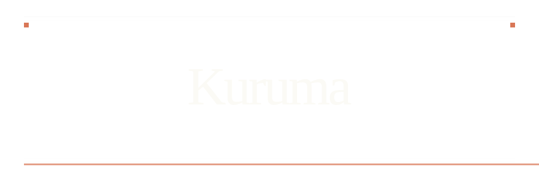
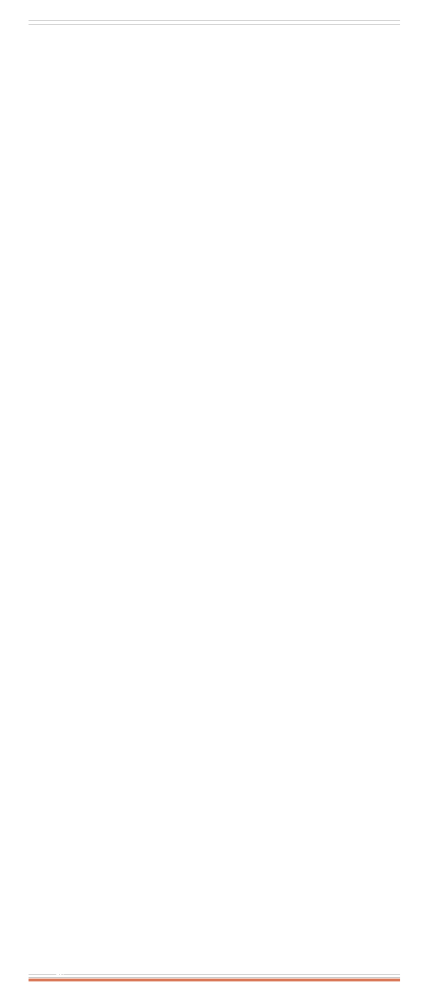



<table style="border-collapse:separate; border-spacing:0 0;"><tr>
  <td width="40%" valign="middle" align="center" style="background:#0d1117; padding:12px 14px 12px 0;">
    
━━━━✦ ENGLISH ✦━━━━ 1.AAAAAAAAAAAAAAAAAAAAAAAAAAAA 2.AAAAAAAAAAAAAAAAAAAAAAAAAAAA 3.AAAAAAAAAAAAAAAAAAAAAAAAAAAA 4.AAAAAAAAAAAAAAAAAAAAAAAAAAAA 5.AAAAAAAAAAAAAAAAAAAAAAAAAAAA 6.AAAAAAAAAAAAAAAAAAAAAAAAAAAA 7.AAAAAAAAAAAAAAAAAAAAAAAAAAAA 8.AAAAAAAAAAAAAAAAAAAAAAAAAAAA 9.AAAAAAAAAAAAAAAAAAAAAAAAAAAA 10.AAAAAAAAAAAAAAAAAAAAAAAAAAA 11.AAAAAAAAAAAAAAAAAAAAAAAAAAA 12.AAAAAAAAAAAAAAAAAAAAAAAAAAA 13.AAAAAAAAAAAAAAAAAAAAAAAAAAA 14.AAAAAAAAAAAAAAAAAAAAAAAAAAA 15.AAAAAAAAAAAAAAAAAAAAAAAAAAA 16.AAAAAAAAAAAAAAAAAAAAAAAAAAA 17.AAAAAAAAAAAAAAAAAAAAAAAAAAA 18.AAAAAAAAAAAAAAAAAAAAAAAAAAA 19.AAAAAAAAAAAAAAAAAAAAAAAAAAA 20.AAAAAAAAAAAAAAAAAAAAAAAAAAA 21.AAAAAAAAAAAAAAAAAAAAAAAAAAA 22.AAAAAAAAAAAAAAAAAAAAAAAAAAA 23.AAAAAAAAAAAAAAAAAAAAAAAAAAA ━━━━✦ РУССКИЙ ✦━━━━ 1.AAAAAAAAAAAAAAAAAAAAAAAAAAAA 2.AAAAAAAAAAAAAAAAAAAAAAAAAAAA 3.AAAAAAAAAAAAAAAAAAAAAAAAAAAA 4.AAAAAAAAAAAAAAAAAAAAAAAAAAAA 5.AAAAAAAAAAAAAAAAAAAAAAAAAAAA 6.AAAAAAAAAAAAAAAAAAAAAAAAAAAA 7.AAAAAAAAAAAAAAAAAAAAAAAAAAAA 8.AAAAAAAAAAAAAAAAAAAAAAAAAAAA 9.AAAAAAAAAAAAAAAAAAAAAAAAAAAA 10.AAAAAAAAAAAAAAAAAAAAAAAAAAA 11.AAAAAAAAAAAAAAAAAAAAAAAAAAA 12.AAAAAAAAAAAAAAAAAAAAAAAAAAA 13.AAAAAAAAAAAAAAAAAAAAAAAAAAA 14.AAAAAAAAAAAAAAAAAAAAAAAAAAA 15.AAAAAAAAAAAAAAAAAAAAAAAAAAA 16.AAAAAAAAAAAAAAAAAAAAAAAAAAA 17.AAAAAAAAAAAAAAAAAAAAAAAAAAA 18.AAAAAAAAAAAAAAAAAAAAAAAAAAA 19.AAAAAAAAAAAAAAAAAAAAAAAAAAA 20.AAAAAAAAAAAAAAAAAAAAAAAAAAA 21.AAAAAAAAAAAAAAAAAAAAAAAAAAA 22.AAAAAAAAAAAAAAAAAAAAAAAAAAA 23.AAAAAAAAAAAAAAAAAAAAAAAAAAA 24.AAAAAAAAAAAAAAAAAAAAAAAAAAA 25.AAAAAAAAAAAAAAAAAAAAAAAAAAA

  </td>
  <td width="60%" valign="middle" align="center" style="padding:12px 0 12px 14px;">
    
  </td>
</tr></table>

  <em>Backend &amp; Infrastructure · Scalable systems &amp; open-source</em>

---

## About

> Developer focused on **backend systems** and **infrastructure**.
> Building scalable solutions and pragmatic open-source projects.

**Stack:** Kotlin · Rust · Go · Python · PostgreSQL · Docker · Redis · Kafka · gRPC

---

  
  
  

  

