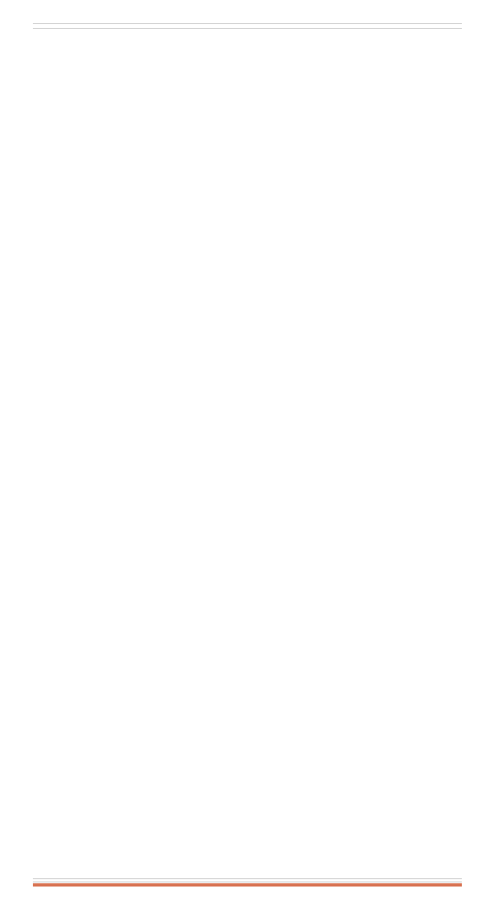

  

<table style="border-collapse:separate; border-spacing:0 0;">
  <tr>
    <td width="42%" valign="middle" align="left" style="background:#0d1117; padding:16px 18px; border-radius:8px;">
      ━━━━✦ ENGLISH ✦━━━━
      

        • Focused on <b>scalable backend systems</b> and infrastructure. 
        • Architecting distributed services, high-throughput pipelines & security. 
        • Crafting pragmatic open-source solutions.
      

      ━━━━✦ РУССКИЙ ✦━━━━
      

        • Специализируюсь на <b>бэкенд-системах</b> и инфраструктуре. 
        • Проектирую распределенные сервисы, отказоустойчивость и безопасность. 
        • Разрабатываю масштабируемые open-source проекты.
      

    </td>
    <td width="58%" valign="middle" align="center" style="padding:0 0 0 14px;">
      
    </td>
  </tr>
</table>

---

> Want to know what I'm currently working on ?\
> Checkout my active roadmap and projects below:
> 
> *PS: Building scalable backend infrastructure and robust distributed services !*
> - [x] [`WetID`](https://github.com/KurumaOfficial/WetID) — Identity & Auth microservice powered by Go, Supabase & Cloudflare
> - [x] [`Delta Media`](https://github.com/KurumaOfficial/Delta_Client_Media_Portal) — High-throughput media portal & recode daemon
> - [x] [`wettea.xyz`](https://wettea.xyz) — Central gateway and web infrastructure
> - [x] [`aleph.icu`](https://aleph.icu) — Next-gen creative studio & tools
> - [ ] [`Distributed Mesh`](https://github.com/KurumaOfficial) — Event-driven pipelines with Kafka, Redis and gRPC
>   - → *Actively optimizing service latency and cluster security (2026)*

---

## My favorite tools and technologies ⚙️

> Tools and technologies that I have worked with and am interested in

<table>
  <tr>
    <td align="center" width="96">
      
       Go
    </td>
    <td align="center" width="96">
      
       Rust
    </td>
    <td align="center" width="96">
      
       Kotlin
    </td>
    <td align="center" width="96">
      
       Python
    </td>
    <td align="center" width="96">
      
       C++
    </td>
    <td align="center" width="96">
      
       C#
    </td>
    <td align="center" width="96">
      
       TypeScript
    </td>
    <td align="center" width="96">
      
       gRPC / REST
    </td>
    <td align="center" width="96">
      
       Docker
    </td>
  </tr>
  <tr>
    <td align="center" width="96">
      
       PostgreSQL
    </td>
    <td align="center" width="96">
      
       Redis
    </td>
    <td align="center" width="96">
      
       Kafka
    </td>
    <td align="center" width="96">
      
       Supabase
    </td>
    <td align="center" width="96">
      
       Cloudflare
    </td>
    <td align="center" width="96">
      
       Linux
    </td>
    <td align="center" width="96">
      
       Git
    </td>
    <td align="center" width="96">
      
       GitHub Actions
    </td>
    <td align="center" width="96">
      
       Nginx
    </td>
  </tr>
</table>

---

  
<b>📦 Featured Projects & Services</b>

   

| Project | Description | Stack | Status / Repository |
| :--- | :--- | :--- | :--- |
| **[WetID](https://github.com/KurumaOfficial/WetID)** | Production-ready identity and authentication system with enterprise controls and security audits. | `Go` `PostgreSQL` `Supabase` `Cloudflare` |  |
| **[Delta Media Portal](https://github.com/KurumaOfficial/Delta_Client_Media_Portal)** | Fast media processing portal & recode daemon with high concurrency. | `Go` `Kotlin` `Docker` |  |
| **[wettea.xyz](https://wettea.xyz)** | Main public platform, developer hub and service gateway. | `Cloudflare` `TLS` `API` |  |
| **[Aleph Studio](https://aleph.icu)** | Creative technology studio for bespoke digital products. | `Go` `Web` `Infra` |  |

  
<b>📃 Experience & Focus</b>

   

- 👨‍💻 **Backend & Systems Developer**\
  📆 2023 - Present\
  📍 **Wettea Ecosystem**
  - Designed and deployed scalable authentication and authorization services (`WetID`).
  - Implemented high-throughput media streaming and transcoding solutions.
  - Architected database schemas and migration workflows for zero-downtime releases.

 

- 🛠️ **Infrastructure & DevOps Engineering**\
  📆 2024 - Present\
  📍 **Cloud & Self-Hosted Clusters**
  - Built automated CI/CD pipelines with GitHub Actions and containerization.
  - Configured edge security, WAF and reverse proxies via Cloudflare & Nginx.

  
<b>💻 Workspace & Environment</b>

   

  
  
  
  

  
<b>📊 Stats & Activity</b>

   

  

  
  

---

  
  
  

  

