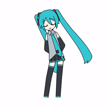

  

<table style="border-collapse:separate; border-spacing:0 0;">
  <tr>
    <td width="42%" valign="middle" align="left" style="background:#0d1117; padding:16px 18px; border-radius:8px;">
      

        • I take freelance orders. Full-time — only if salary starts with <code style="font-family:Consolas,'Courier New',monospace;background:#161b22;padding:1px 5px;border-radius:4px;color:#d97757;font-size:12px;">5e+12</code>. 
        • If you work with me, the rules are simple: "one fuck-up — two teeth out, motherfucker". 
        • I love monotonous and boring work. 
        • I write books and stories. 
        • The principle — “either perfect or nothing”. 
        • I don't ship broken. Better ship nothing. 
        • A mistake costs you double. 
        • Open source is not charity. Quality costs money. 
        • Clean minimalist code and design. No exceptions. 
        • Minimalist everywhere, not just in code. 
        • No compromise on quality. I cut scope. 
        • Impossible conditions — impossible consequences. 
        • Deadlines are sacred — while the conditions hold. 
        • No calls, no meetings. Text only. 
        • I reply slowly. Always to the point. 
        • I don't work for exposure. 
        • I don't do free test tasks. 
        • Prepayment first, work after. 
        • The price is fixed once. 
        • I read logs before asking. 
        • If it's not written down, it doesn't exist. 
        • I delete what I don't use. 
        • Old code gets rewritten, not patched forever. 
        • I don't chase trends. 
        • One task at a time.
      

      — short facts —
      

        • I hate Microsoft. 
        • I really love money. 
        • Bad imagination. 
        • Not very sociable. 
        • Bad person. 
        • Quiet by default. 
        • Rarely online. 
        • Short answers, long code.
      

    </td>
    <td width="58%" valign="middle" align="center" style="padding:0 0 0 14px;">
      
    </td>
  </tr>
</table>

Russian version: <a href="./README_RU.md">README_RU.md</a>

---

> Want to work with me? Ping me on Telegram — [@Kuruma31](https://t.me/Kuruma31). Text only, no calls.\
> First message: task, scope, deadline, budget. Prepayment first, work after.
>
> *How an order goes: you text me, I reply (slowly) with a fixed price, you pay upfront, I ship or I ship nothing. Done work goes to support mode, new scope is a new order. No calls, no meetings, no free test tasks.*

---

## My favorite tools and technologies ⚙️

> Tools and technologies that I have worked with and am interested in

<table>
  <tr>
    <td align="center" width="96">
      
       Go
    </td>
    <td align="center" width="96">
      
       Rust
    </td>
    <td align="center" width="96">
      
       Kotlin
    </td>
    <td align="center" width="96">
      
       Python
    </td>
    <td align="center" width="96">
      
       TypeScript
    </td>
    <td align="center" width="96">
      
       Java
    </td>
    <td align="center" width="96">
      
       HTML
    </td>
    <td align="center" width="96">
      
       CSS
    </td>
    <td align="center" width="96">
      
       gRPC / REST
    </td>
  </tr>
  <tr>
    <td align="center" width="96">
      
       Docker
    </td>
    <td align="center" width="96">
      
       PostgreSQL
    </td>
    <td align="center" width="96">
      
       Redis
    </td>
    <td align="center" width="96">
      
       Kafka
    </td>
    <td align="center" width="96">
      
       Supabase
    </td>
    <td align="center" width="96">
      
       Cloudflare
    </td>
    <td align="center" width="96">
      
       Linux
    </td>
    <td align="center" width="96">
      
       Git
    </td>
    <td align="center" width="96">
      
       SQLite
    </td>
  </tr>
</table>

---

  
<b>📦 Featured Projects & Services</b>

   

| Project | Description | Stack | Status / Repository |
| :--- | :--- | :--- | :--- |
| **[Delta Media](https://github.com/KurumaOfficial/Delta-Media)** | Media partnership & staff moderation portal for Delta Client: key-based auth, Telegram 2FA with GPS, USDT payouts via CryptoBot. | `Go` `Fiber` `PostgreSQL` `Telegram API` |  |
| **[Strange Visuals](https://github.com/KurumaOfficial/Strange-Visuals)** | Revived abandoned Minecraft Fabric visual mod (1.21.8): refactored legacy codebase, Gradle build, Java 21. | `Java` `Fabric` `Gradle` |  |

  
<b>📃 Resume</b>

## Education

- 📖 **IM — Informasjonsteknologi og medieproduksjon**\
  📆 2026 - 2030\
  📍 **Sentrum videregående skole** - Kongsvinger, Norway

## Experience

<!-- To add a new job, copy the block below: badges on the right, role, dates, place, bullet points -->

- 👨‍💻 **Freelance Developer**\
  📆 2026 - ???\
  📍 **Custom Orders** - Remote
  - Delta Media,

  
<b>💻 Workspace & Environment</b>

   

  🖥️ Desktop  
  
  
  
  

  💻 Laptop  
  
  
  
  

  💾 Software  
  
  

  
  
  

  
  
  

  
<b>📊 Stats and Activity</b>

  <h3>💻 GitHub Profile Stats</h3>

  <!-- GitHub Readme Streak Stats - https://github.com/DenverCoder1/github-readme-streak-stats -->
  

    
  

  <!-- https://github.com/anuraghazra/github-readme-stats -->
  

    
    
  

  <h3>📈 Contribution Chart</h3>

  <!-- https://github.com/vn7n24fzkq/github-profile-summary-cards -->
  <table>
    <tr>
      <td width="67%" align="center">
        
      </td>
      <td width="33%" align="center">
        
      </td>
    </tr>
  </table>

---

  
  
  

  

